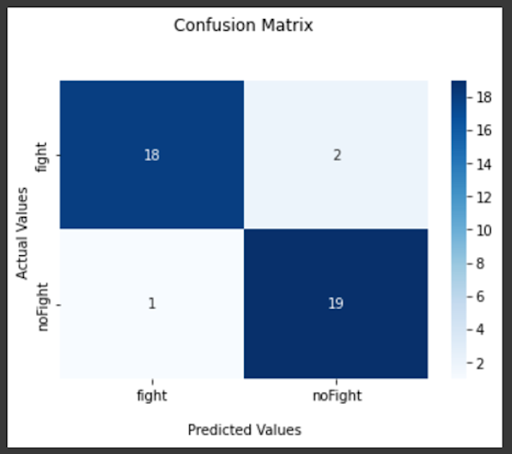

<center align="center">
<h1 align="center"><font size="+4">Fight Detection Project</font></h1>
</center>

---

 
 


https://user-images.githubusercontent.com/45875057/151727113-140621a9-435e-45bf-9297-e8de9f12e122.mp4


https://user-images.githubusercontent.com/45875057/151727354-c6cb1c80-8da3-4c49-aaf7-655a46c3b324.mp4


<h1 color="green"><b>Abstract</b></h1>
<p>Vision-based activity recognition is one of the most challenging research topics of computer vision and pattern recognition. 
 A specific application of it, namely, detecting fights from surveillance cameras in public areas, prisons, etc., is desired, 
 to get violent incidents  under control quickly to reduce casualties.
</p>

<h1 color="green"><b>Results</b></h1>
<table style="width:100%">
  <tr>
    <th>Model</th>
    <th>Top-1 Accuracy</th>
    <th>Batch Size (Videos)</th>
    <th>Input Frames</th>
    <th>Recall (Fight)</th>
    <th>Inference Rate (Videos/sec)</th>
  </tr>
  
  <tr>
    <td>r2plus1d_18</td> <td>77.5%</td>  <td>4</td>  <td>16</td>  <td>0.75</td>  <td>10</td>
  </tr>
 
 <tr>
    <td>r3d_18</td> <td>82.5%</td>  <td>4</td>  <td>16</td>  <td>0.85</td>  <td>10</td>
  </tr>
 
 <tr>
    <td>mc3_18</td> <td>90%</td>  <td>4</td>  <td>16</td>  <td>0.80</td>  <td>10</td>
  </tr>
 
 <tr>
    <td>mc3_18</td> <td>92.5%</td>  <td>8</td>  <td>16</td>  <td>0.90</td>  <td>10</td>
  </tr>
 
 <tr>
    <td>mc3_18</td> <td>85%</td>  <td>4</td>  <td>32</td>  <td>0.90</td>  <td>5.7</td>
  </tr>
  
</table>


<h1 color="green"><b>Pytorch Pretrained Models</b></h1>
<p>All pretrained models can be found in this link.
 <a href="https://pytorch.org/vision/stable/models.html">https://pytorch.org/vision/stable/models.html</a></p>

<h1 style="color: blue"><b>Confusion Matrix</b></h1>



<h1 color="green"><b>Inference</b></h1>
<p>Run the infer.py script and pass the required arguments (modelPath, streaming, inputPath, outputPath, sequenceLength, skip, showInfo) <br>

python -m infer \ <br>
--modelPath="./FDSC/models/model_16_m3_0.8888.pth" \ <br>
--streaming=False \ <br>
--inputPath="./inputTestVideo.mp4" `Or Streaming Url in case of streaming = True` \ <br>
--outputPath="./outputVideo.mp4" \ <br>
--sequenceLength=16 \ <br>
--skip=2 \ <br>
--showInfo=True </p> <br>


<h1 color="green"><b>Instructions to Install our Fight Detection Package</b></h1>
<p>Our Package can be found in this link.
 <a href="https://pypi.org/project/Fight-Detection/0.0.3/">https://pypi.org/project/Fight-Detection/0.0.3/</a></p>

1. Install:

```python
pip install Fight-Detection==0.0.3
pip install pytube
```
2. Download Our Finetuned Model Weights:

```python
import gdown
url = 'https://drive.google.com/uc?id=1MWDeLnpEaZDrKK-OjmzvYLxfjwp-GDcp'
output = 'model_16_m3_0.8888.pth'
gdown.download(url, output, quiet=False)
```
3. Detect Fight or Not by Pass your Local Video:

```python
from fight_detection import Fight_utils
# Run the Below Function by Input your Test Video Path to get the outPut Video with Fight Detection or Not
Fight_utils.fightDetection(inputPath,seq,skip,outputPath,showInfo)
```
4. Show the Output Video with Detection:

```python
from moviepy.editor import *
VideoFileClip(outputPath, audio=False, target_resolution=(300,None)).ipython_display()
```
5- Detect the Fight on Streaming:

```python
Fight_utils.start_streaming(streamingURL)
```


<!-- 
<div style="float:left"> </div> -->
