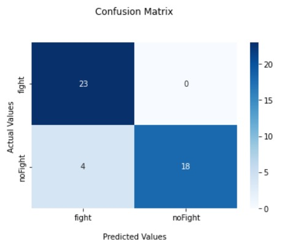

 

<center align="center">
<h1 align="center"><font size="+4">Fight Detection Project</font></h1>
</center>

---

 
 


<h1 color="green"><b>Abstract</b></h1>
<p>Human action recognition can be seen as the automatic labeling of a video according to the actions occurring in it. It has
become one of the most challenging and attractive problems in the pattern recognition and video classification fields.
The problem itself is difficult to solve by traditional video processing methods because of several challenges such as
the background noise, sizes of subjects in different videos, and the speed of actions.Derived from the progress of
deep learning methods, several directions are developed to recognize a human action from a video, such as the
long-short-term memory (LSTM)-based model, two-stream convolutional neural network (CNN) model, and the convolutional 3D model.
Human action recognition is used in some surveillance systems and video processing tools.
Our main problem is Fight Detection which we achieved to solve by using transfer learning on pretrained convolutional 3D models
that aim to recognize the motions and actions of humans.
All models use Kinetics-400 dataset for the pretrained part and Vision-based Fight Detection From Surveillance Cameras dataset
for the finetuned part.</p>

<h1 color="green"><b>Results</b></h1>
<table style="width:100%">
  <tr>
    <th>Model</th>
    <th>Top-1 Accuracy</th>
    <th>Batch Size (Videos)</th>
    <th>Input Frames</th>
    <th>Inference Time (Videos/sec)</th>
  </tr>
  
  <tr>
    <td>r2plus1d_18</td> <td>82.22%</td>  <td>4</td>  <td>16</td>  <td>11.3</td>
  </tr>
 
 <tr>
    <td>r3d_18</td> <td>88.89%</td>  <td>4</td>  <td>16</td>  <td>11.3</td>
  </tr>
 
 <tr>
    <td>mc3_18</td> <td>91.11%</td>  <td>4</td>  <td>16</td>  <td>11.3</td>
  </tr>
 
 <tr>
    <td>mc3_18</td> <td>91.11%</td>  <td>8</td>  <td>16</td>  <td>11.3</td>
  </tr>
 
 <tr>
    <td>mc3_18</td> <td>83.72%</td>  <td>4</td>  <td>32</td>  <td>5.63</td>
  </tr>
  
</table>


<h1 color="green"><b>Pytorch Pretrained Models</b></h1>
<p>All pretrained models can be found in this link.
 <a href="https://pytorch.org/vision/stable/models.html">lhttps://pytorch.org/vision/stable/models.html</a></p>

<h1 style="color: blue"><b>Confusion Matrix</b></h1>



<h1 color="green"><b>Inference</b></h1>
<p>Run the infer.py script and pass the required arguments (model path, input & output paths, sequence length, skip frames, streaming) <br>
python -m infer \ <br>
--modelPath="/to/model_16_70_4_0.88.pth" \ <br>
--inputPath="/to/input.mp4" \ <br>
--outputPath="/to/output.mp4" \ <br>
--streamingURL<br>
--sequenceLength=16 \ <br>
--skip=2 \ <br>
--showInfo=True \<br>
 --streaming=False</p><br>


<h1 color="green"><b>Instructions to Install our Fight Detection Package</b></h1>

```python
pip install Feight-Detection-From-Surveillance-Cameras
pip install pafy youtube-dl moviepy
pip install pytube

   #Download Finetuned Model Weights
gdown --id 1MWDeLnpEaZDrKK-OjmzvYLxfjwp-GDcp<

from fight_detection import Fight_utils
from moviepy.editor import *
```


<div style="float:left"> </div>
